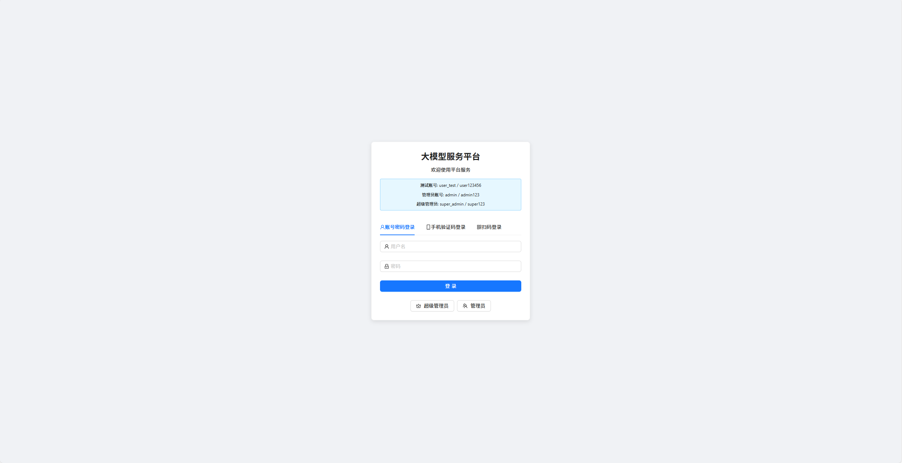
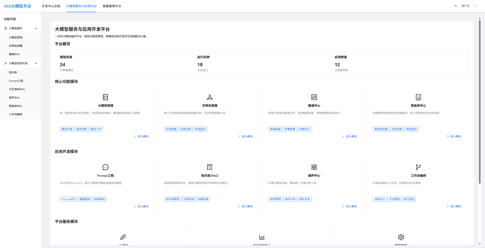
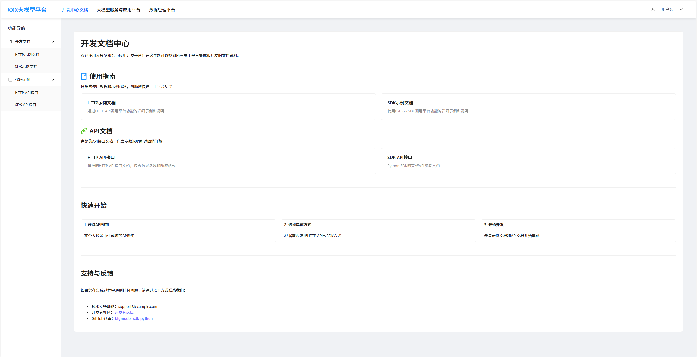
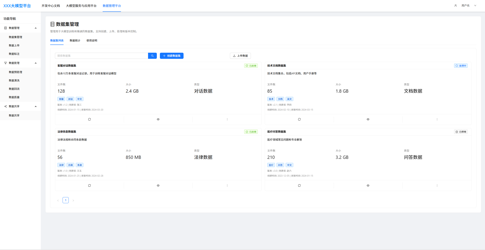

# BigModel

**Read this in other languages: [English](README.md), [中文](README_zh.md).**

#### Introduction
This is a comprehensive large model service platform designed to facilitate rapid deployment and application of large model services in small and medium-sized enterprises, as well as to provide a good understanding of different modules of large models. The platform mainly includes large model service and application modules, data management modules, and development documentation modules. The large model service application module consists of large model management, large model instance deployment, large model service monitoring, large model service invocation, Prompt engineering,RAG, AIGC experience interaction, agent development modules, AI workflows, third-party plugin integration, and more; the data management module includes data processing, data cleaning, data feedback, data pre-training, and other content; the development documentation mainly includes example sections and API interface sections, supporting both HTTP and Python SDK invocation methods, with gradual addition of both Chinese and English versions.

#### Software Architecture Description
Refer to the platform structure and permission management sections.

#### Installation Guide
node version: latest version
npm version: 10.9.2

#### Usage Instructions

Frontend
```
cd frontend 
npm run dev
```
Backend
```
cd backend
npm run start:dev
```
##### Test Account
- Username: user_test Password: user123456 
> After successful login, you will be redirected to the /training page Test mobile number verification has been added to mobile verification code > login:

- Mobile number: 13800000000 Verification code: 123456   
> After successful login, you will also be redirected to the /training page


#### Contributing

1. Fork this repository
2. Create a Feat_xxx branch
3. Commit code
4. Create a Pull Request

#### Open Source License

This project uses the Apache License 2.0. See the [LICENSE](LICENSE) file for details.

#### Project Screenshots
1. Login page

2. Large Model Service and Application page

3. Development Center page

4. Data Management page
